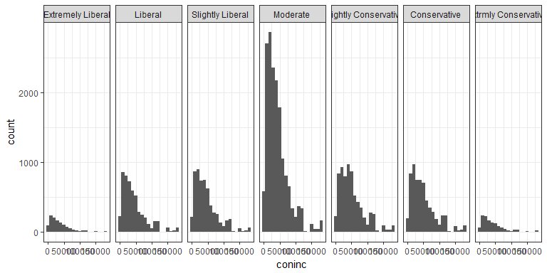

##Synopsis

This analysis performs exploratory data anlaysis and statiscal inferance with a General Social Survey (GSS) dataset.

## Setup

We will first prepare the workspace environment by setting global options

### Set Global Options


```r
#Install Knitr pckage if necessary and load Knitr library
list.of.packages <- c("knitr")
new.packages <- list.of.packages[!(list.of.packages %in% installed.packages()[,"Package"])]
if(length(new.packages)) install.packages(new.packages, repos = "http://cran.us.r-project.org")
suppressWarnings ( suppressMessages ( library ( knitr ) ) )
knitr::opts_chunk$set(fig.width=8, fig.height=4, fig.path='figures/DataAnalysisProject_', echo=TRUE, warning=FALSE, message=FALSE)
#Clear variables
rm ( list = ls ( all = TRUE ) )
#Get and set working directory
setwd ( getwd ( ) )
```

### Load Packages

Install and load required libraries if neccessary.


```r
#Check installed status of requried packages, and install if necessary
list.of.packages <-
c("dplyr", "ggplot2", "scales", "readxl", "kableExtra")
new.packages <-
list.of.packages[!(list.of.packages %in% installed.packages()[, "Package"])]
if (length(new.packages))
install.packages(new.packages, repos = "http://cran.us.r-project.org")
suppressWarnings (suppressMessages (library (dplyr)))
suppressWarnings (suppressMessages (library (ggplot2)))
suppressWarnings (suppressMessages (library (scales)))
suppressWarnings (suppressMessages (library (readxl)))
suppressWarnings (suppressMessages (library (kableExtra)))
```

### Load Data

Load the data set. 


```r
load (
  url (
  "https://d3c33hcgiwev3.cloudfront.net/_5db435f06000e694f6050a2d43fc7be3_gss.Rdata?Expires=1512604800&Signature=RrxvDxYwCH6nUMgx8MmXy6iXon43J0xAiIbw1usFdnW77kLM97Rh7-dyF767sTbj9CID6JSqcbSDeh4QWxMeDhDnz4hfGh~LMM3BcxQhE8e3Lg5unWGpQTvx43tq4dhkaDx6ZPv78CJX1rOvxMPyR9pZtl2XDVwwHm0z6w-VWxs_&Key-Pair-Id=APKAJLTNE6QMUY6HBC5A"
  )
  )
```


* * *

## Part 1: Data

The vast majority of GSS data is obtained in face-to-face interviews. Computer-assisted personal interviewing (CAPI) began in the 2002 GSS. Under some conditions when it has proved difficult to arrange an in-person interview with a sampled respondent, GSS interviews may be conducted by telephone.
[@http://gss.norc.org/Pages/Faq.aspx]

The target population of the GSS is adults (18+) living in households in the United States. The GSS sample is drawn using an area probability design that randomly selects respondents in households across the United States to take part in the survey. Respondents that become part of the GSS sample are from a mix of urban, suburban, and rural geographic areas. Participation in the study is strictly voluntary. However, because only about a few thousand respondents are interviewed in the main study, every respondent selected is very important to the results.
[@https://en.wikipedia.org/wiki/General_Social_Survey]

The scope of inference for this data is limited to generalizability because it is an observational study, i.e. we cannot determine causality as no random assignment of participants occured.

* * *

## Part 2: Research Question

We will research if there is a statistically significant difference between income based on political views. This is of interest because political alignment is often indicative of fiduciary alignment, which should translate to earnings.

* * *

## Part 3: Exploratory Data Analysis

For our Exploratory Data Analysis, poltical views (variable "polviews") will be our explantory variable, and income ("coninc") will be our response variable.

Let's get a feel for our explanatory variable, "polviews," by determining the unique values.


```r
unique (gss$polviews)
```

```
## [1] <NA>                  Moderate              Slightly Conservative
## [4] Conservative          Liberal               Extrmly Conservative 
## [7] Slightly Liberal      Extremely Liberal    
## 7 Levels: Extremely Liberal Liberal Slightly Liberal ... Extrmly Conservative
```


There are 7 unique political views, excluding NA values.

Let's visualize the distribution of income per poltical view by using box plots. Note we will exclude NAs.


```r
ggplot(data = subset(gss,!is.na(polviews) &
                       coninc), aes(x = polviews, y = coninc)) +
                       geom_boxplot(fill = "#56B4E9") +
                       labs(title = "Income by Political Views", x = "Political View", y = "Income") +
                       #format y-scale
                       scale_y_continuous(labels = dollar, breaks = seq(0, 200000, by = 25000)) 
```

<!-- -->

We can see that conservative views appear to have higher median incomes, but more variability. Also, it appears that income decreases as political views become more moderate.

Let's calculate summary statistics.


```r
#Compute summary stats
GSSSummary <- gss %>%
  filter(polviews != "NA") %>%
  group_by (polviews) %>%
  summarise (
  Respondents = n (),
  MinIncome = min(coninc, na.rm = TRUE),
  MaxIncome = max(coninc, na.rm = TRUE),
  AverageIncome = mean(coninc, na.rm = TRUE),
  MedianIncome = median(coninc, na.rm = TRUE),
  IncomeIQR = IQR(coninc, na.rm = TRUE)
  ) %>%
  arrange (desc(AverageIncome))
  
  #Create summary table
  suppressWarnings (suppressMessages (library (kableExtra)))
  GSSSummary %>%
  kable("html") %>%
  kable_styling()
```

<table class="table" style="margin-left: auto; margin-right: auto;">
<thead><tr>
<th style="text-align:left;"> polviews </th>
   <th style="text-align:right;"> Respondents </th>
   <th style="text-align:right;"> MinIncome </th>
   <th style="text-align:right;"> MaxIncome </th>
   <th style="text-align:right;"> AverageIncome </th>
   <th style="text-align:right;"> MedianIncome </th>
   <th style="text-align:right;"> IncomeIQR </th>
  </tr></thead>
<tbody>
<tr>
<td style="text-align:left;"> Slightly Conservative </td>
   <td style="text-align:right;"> 7691 </td>
   <td style="text-align:right;"> 402 </td>
   <td style="text-align:right;"> 180386 </td>
   <td style="text-align:right;"> 50707.66 </td>
   <td style="text-align:right;"> 42083.0 </td>
   <td style="text-align:right;"> 44900.00 </td>
  </tr>
<tr>
<td style="text-align:left;"> Conservative </td>
   <td style="text-align:right;"> 7092 </td>
   <td style="text-align:right;"> 383 </td>
   <td style="text-align:right;"> 180386 </td>
   <td style="text-align:right;"> 49738.12 </td>
   <td style="text-align:right;"> 39695.0 </td>
   <td style="text-align:right;"> 46377.25 </td>
  </tr>
<tr>
<td style="text-align:left;"> Slightly Liberal </td>
   <td style="text-align:right;"> 6181 </td>
   <td style="text-align:right;"> 383 </td>
   <td style="text-align:right;"> 180386 </td>
   <td style="text-align:right;"> 45256.97 </td>
   <td style="text-align:right;"> 36482.0 </td>
   <td style="text-align:right;"> 40498.00 </td>
  </tr>
<tr>
<td style="text-align:left;"> Liberal </td>
   <td style="text-align:right;"> 5582 </td>
   <td style="text-align:right;"> 383 </td>
   <td style="text-align:right;"> 180386 </td>
   <td style="text-align:right;"> 44259.32 </td>
   <td style="text-align:right;"> 34470.0 </td>
   <td style="text-align:right;"> 41715.00 </td>
  </tr>
<tr>
<td style="text-align:left;"> Extrmly Conservative </td>
   <td style="text-align:right;"> 1506 </td>
   <td style="text-align:right;"> 402 </td>
   <td style="text-align:right;"> 180386 </td>
   <td style="text-align:right;"> 42261.62 </td>
   <td style="text-align:right;"> 31854.0 </td>
   <td style="text-align:right;"> 41223.00 </td>
  </tr>
<tr>
<td style="text-align:left;"> Moderate </td>
   <td style="text-align:right;"> 18494 </td>
   <td style="text-align:right;"> 383 </td>
   <td style="text-align:right;"> 180386 </td>
   <td style="text-align:right;"> 42100.79 </td>
   <td style="text-align:right;"> 34470.0 </td>
   <td style="text-align:right;"> 37866.00 </td>
  </tr>
<tr>
<td style="text-align:left;"> Extremely Liberal </td>
   <td style="text-align:right;"> 1330 </td>
   <td style="text-align:right;"> 383 </td>
   <td style="text-align:right;"> 178712 </td>
   <td style="text-align:right;"> 39147.52 </td>
   <td style="text-align:right;"> 29065.5 </td>
   <td style="text-align:right;"> 39030.25 </td>
  </tr>
</tbody>
</table>

We do see that "Slightly Conservative" has the most variability, and also the highest mean and median income. Let's now determine if there is any statistical income difference between the political views.

Let's also plot histograms to gauge normality


```r
ggplot(data = subset(gss, !is.na(polviews) &
                       coninc), aes(x = coninc)) + geom_histogram(binwidth = 10000) + 
                       facet_grid( ~ polviews) + theme_bw()
```

<!-- -->


* * *

## Part 4: Inference

We will use one-way ANOVA for our test of statistical significance.


```r
GSSAOV <-
  aov(coninc ~ polviews, data = subset(gss, !is.na(polviews) &
  coninc)) #Calculate ANOVA
  summary(GSSAOV)
```

```
##                Df    Sum Sq   Mean Sq F value Pr(>F)    
## polviews        6 5.637e+11 9.395e+10    72.8 <2e-16 ***
## Residuals   43330 5.592e+13 1.290e+09                   
## ---
## Signif. codes:  0 '***' 0.001 '**' 0.01 '*' 0.05 '.' 0.1 ' ' 1
```


Also, we will evaulate the paired combinations of political views with Tukey multiple pairwise-comparisons


```r
TukeyHSD(GSSAOV)
```

```
##   Tukey multiple comparisons of means
##     95% family-wise confidence level
## 
## Fit: aov(formula = coninc ~ polviews, data = subset(gss, !is.na(polviews) & coninc))
## 
## $polviews
##                                                  diff         lwr
## Liberal-Extremely Liberal                   5111.8047   1738.3401
## Slightly Liberal-Extremely Liberal          6109.4554   2770.1648
## Moderate-Extremely Liberal                  2953.2734   -188.4999
## Slightly Conservative-Extremely Liberal    11560.1473   8275.9745
## Conservative-Extremely Liberal             10590.6043   7278.1949
## Extrmly Conservative-Extremely Liberal      3114.1004  -1116.4437
## Slightly Liberal-Liberal                     997.6507  -1037.3977
## Moderate-Liberal                           -2158.5312  -3850.0690
## Slightly Conservative-Liberal               6448.3427   4505.0589
## Conservative-Liberal                        5478.7997   3488.1674
## Extrmly Conservative-Liberal               -1997.7043  -5297.4109
## Moderate-Slightly Liberal                  -3156.1819  -4778.4946
## Slightly Conservative-Slightly Liberal      5450.6920   3567.3571
## Conservative-Slightly Liberal               4481.1490   2548.9959
## Extrmly Conservative-Slightly Liberal      -2995.3550  -6260.1157
## Slightly Conservative-Moderate              8606.8739   7101.2749
## Conservative-Moderate                       7637.3309   6071.0955
## Extrmly Conservative-Moderate                160.8269  -2901.6134
## Conservative-Slightly Conservative          -969.5430  -2804.7937
## Extrmly Conservative-Slightly Conservative -8446.0470 -11654.4098
## Extrmly Conservative-Conservative          -7476.5040 -10713.7647
##                                                   upr     p adj
## Liberal-Extremely Liberal                   8485.2692 0.0001605
## Slightly Liberal-Extremely Liberal          9448.7459 0.0000014
## Moderate-Extremely Liberal                  6095.0468 0.0815302
## Slightly Conservative-Extremely Liberal    14844.3202 0.0000000
## Conservative-Extremely Liberal             13903.0138 0.0000000
## Extrmly Conservative-Extremely Liberal      7344.6445 0.3117770
## Slightly Liberal-Liberal                    3032.6991 0.7769970
## Moderate-Liberal                            -466.9934 0.0031958
## Slightly Conservative-Liberal               8391.6265 0.0000000
## Conservative-Liberal                        7469.4319 0.0000000
## Extrmly Conservative-Liberal                1302.0023 0.5582672
## Moderate-Slightly Liberal                  -1533.8692 0.0000002
## Slightly Conservative-Slightly Liberal      7334.0269 0.0000000
## Conservative-Slightly Liberal               6413.3020 0.0000000
## Extrmly Conservative-Slightly Liberal        269.4057 0.0969133
## Slightly Conservative-Moderate             10112.4729 0.0000000
## Conservative-Moderate                       9203.5663 0.0000000
## Extrmly Conservative-Moderate               3223.2672 0.9999988
## Conservative-Slightly Conservative           865.7077 0.7095292
## Extrmly Conservative-Slightly Conservative -5237.6841 0.0000000
## Extrmly Conservative-Conservative          -4239.2432 0.0000000
```

