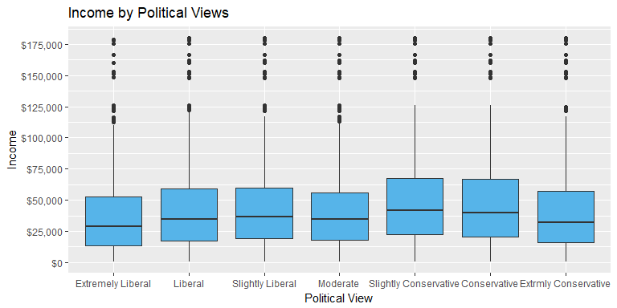
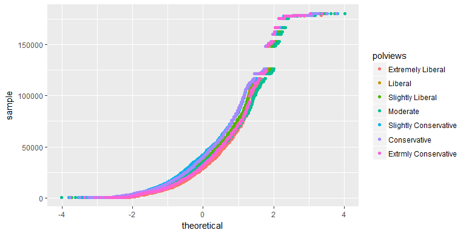

##Synopsis

This analysis performs exploratory data anlaysis and statistical inference with a General Social Survey (GSS) dataset prepared for use by Coursera students.

## Setup

We will first prepare the workspace environment by setting global options.

### Set Global Options


```r
#Install Knitr pckage if necessary and load Knitr library
list.of.packages <- c("knitr")
new.packages <- list.of.packages[!(list.of.packages %in% installed.packages()[,"Package"])]
if(length(new.packages)) install.packages(new.packages, repos = "http://cran.us.r-project.org")
suppressWarnings ( suppressMessages ( library ( knitr ) ) )
knitr::opts_chunk$set(fig.width=8, fig.height=4, fig.path='figures/DataAnalysisProject_', echo=TRUE, warning=FALSE, message=FALSE)
#Clear variables
rm ( list = ls ( all = TRUE ) )
#Get and set working directory
setwd ( getwd ( ) )
```

### Load Packages

Install and load required libraries if neccessary.


```r
#Check installed status of requried packages, and install if necessary
list.of.packages <-
c("dplyr", "ggplot2", "scales", "kableExtra")
new.packages <-
list.of.packages[!(list.of.packages %in% installed.packages()[, "Package"])]
if (length(new.packages))
install.packages(new.packages, repos = "http://cran.us.r-project.org")
suppressWarnings (suppressMessages (library (dplyr)))
suppressWarnings (suppressMessages (library (ggplot2)))
suppressWarnings (suppressMessages (library (scales)))
suppressWarnings (suppressMessages (library (kableExtra)))
```

### Load Data

Load the data set. 


```r
load (url ("https://d3c33hcgiwev3.cloudfront.net/_5db435f06000e694f6050a2d43fc7be3_gss.Rdata?Expires=1512777600&Signature=fSqFvFcwuQ6KQCYc-sGFX42wym9hhfZTBDUWr8v0wvLpkDdt6rCL1zmoefY7U11h9Q5TVJBjQJyBUvqWvIfIaWkwJVa6euAUE3IqzcAmbL67gNcDOqaNomiXtjpRsPeWgfmIk-p7MFAMpx-WZrThP1AkzjFgst5uo03rm9K8r~o_&Key-Pair-Id=APKAJLTNE6QMUY6HBC5A"))
```


* * *

## Part 1: Data

The vast majority of GSS data is obtained in face-to-face interviews. Computer-assisted personal interviewing (CAPI) began in the 2002 GSS. Under some conditions when it has proved difficult to arrange an in-person interview with a sampled respondent, GSS interviews may be conducted by telephone.
[@http://gss.norc.org/Pages/Faq.aspx]

The target population of the GSS is adults (18+) living in households in the United States. The GSS sample is drawn using an area probability design that randomly selects respondents in households across the United States to take part in the survey. Respondents that become part of the GSS sample are from a mix of urban, suburban, and rural geographic areas. Participation in the study is strictly voluntary. However, because only about a few thousand respondents are interviewed in the main study, every respondent selected is very important to the results.
[@https://en.wikipedia.org/wiki/General_Social_Survey]

The scope of inference for this data is limited to generalizability because it is an observational study, i.e. we cannot determine causality as no random assignment of participants occured.

* * *

## Part 2: Research Question

We will research if there is a statistically significant difference between different poltical view's family income. This is of interest because political alignment is indicative of personality, where conservatives tend to be more conscientiousness, which should be a predictor of higher earnings potential.
[@https://www.economist.com/blogs/democracyinamerica/2012/05/personality-and-polarisation]

* * *

## Part 3: Exploratory Data Analysis

For our Exploratory Data Analysis, poltical views (variable "polviews") will be our explantory variable, and "total family income in constant dollars" (variable "coninc") will be our response variable.

Let's get a feel for our explanatory variable, "polviews," by determining the unique values.


```r
unique (gss$polviews)
```

```
## [1] <NA>                  Moderate              Slightly Conservative
## [4] Conservative          Liberal               Extrmly Conservative 
## [7] Slightly Liberal      Extremely Liberal    
## 7 Levels: Extremely Liberal Liberal Slightly Liberal ... Extrmly Conservative
```

There are 7 unique political views, excluding NA values.

Let's visualize the distribution of income per poltical view by using box plots. Note we will exclude NAs.


```r
ggplot(data = subset(gss,!is.na(polviews) & !is.na(coninc)), aes(x = polviews, y = coninc)) +
                       geom_boxplot(fill = "#56B4E9") +
                       labs(title = "Income by Political Views", x = "Political View", y = "Income") +
                       #format y-scale
                       scale_y_continuous(labels = dollar, breaks = seq(0, 200000, by = 25000)) 
```

<!-- -->

We can see that conservative views appear to have higher median incomes, but more variability. Also, it appears that income decreases as political views become more moderate.

Let's calculate summary statistics.


```r
#Compute summary stats
GSSSummary <- gss %>%
  filter(polviews != "NA") %>%
  group_by (polviews) %>%
  summarise (
  Respondents = n (),
  MinIncome = min(coninc, na.rm = TRUE),
  MaxIncome = max(coninc, na.rm = TRUE),
  AverageIncome = mean(coninc, na.rm = TRUE),
  MedianIncome = median(coninc, na.rm = TRUE),
  IncomeIQR = IQR(coninc, na.rm = TRUE)
  ) %>%
  arrange (desc(AverageIncome))
  
  #Create summary table
  suppressWarnings (suppressMessages (library (kableExtra)))
  GSSSummary %>%
  kable("html") %>%
  kable_styling()
```

<table class="table" style="margin-left: auto; margin-right: auto;">
<thead><tr>
<th style="text-align:left;"> polviews </th>
   <th style="text-align:right;"> Respondents </th>
   <th style="text-align:right;"> MinIncome </th>
   <th style="text-align:right;"> MaxIncome </th>
   <th style="text-align:right;"> AverageIncome </th>
   <th style="text-align:right;"> MedianIncome </th>
   <th style="text-align:right;"> IncomeIQR </th>
  </tr></thead>
<tbody>
<tr>
<td style="text-align:left;"> Slightly Conservative </td>
   <td style="text-align:right;"> 7691 </td>
   <td style="text-align:right;"> 402 </td>
   <td style="text-align:right;"> 180386 </td>
   <td style="text-align:right;"> 50707.66 </td>
   <td style="text-align:right;"> 42083.0 </td>
   <td style="text-align:right;"> 44900.00 </td>
  </tr>
<tr>
<td style="text-align:left;"> Conservative </td>
   <td style="text-align:right;"> 7092 </td>
   <td style="text-align:right;"> 383 </td>
   <td style="text-align:right;"> 180386 </td>
   <td style="text-align:right;"> 49738.12 </td>
   <td style="text-align:right;"> 39695.0 </td>
   <td style="text-align:right;"> 46377.25 </td>
  </tr>
<tr>
<td style="text-align:left;"> Slightly Liberal </td>
   <td style="text-align:right;"> 6181 </td>
   <td style="text-align:right;"> 383 </td>
   <td style="text-align:right;"> 180386 </td>
   <td style="text-align:right;"> 45256.97 </td>
   <td style="text-align:right;"> 36482.0 </td>
   <td style="text-align:right;"> 40498.00 </td>
  </tr>
<tr>
<td style="text-align:left;"> Liberal </td>
   <td style="text-align:right;"> 5582 </td>
   <td style="text-align:right;"> 383 </td>
   <td style="text-align:right;"> 180386 </td>
   <td style="text-align:right;"> 44259.32 </td>
   <td style="text-align:right;"> 34470.0 </td>
   <td style="text-align:right;"> 41715.00 </td>
  </tr>
<tr>
<td style="text-align:left;"> Extrmly Conservative </td>
   <td style="text-align:right;"> 1506 </td>
   <td style="text-align:right;"> 402 </td>
   <td style="text-align:right;"> 180386 </td>
   <td style="text-align:right;"> 42261.62 </td>
   <td style="text-align:right;"> 31854.0 </td>
   <td style="text-align:right;"> 41223.00 </td>
  </tr>
<tr>
<td style="text-align:left;"> Moderate </td>
   <td style="text-align:right;"> 18494 </td>
   <td style="text-align:right;"> 383 </td>
   <td style="text-align:right;"> 180386 </td>
   <td style="text-align:right;"> 42100.79 </td>
   <td style="text-align:right;"> 34470.0 </td>
   <td style="text-align:right;"> 37866.00 </td>
  </tr>
<tr>
<td style="text-align:left;"> Extremely Liberal </td>
   <td style="text-align:right;"> 1330 </td>
   <td style="text-align:right;"> 383 </td>
   <td style="text-align:right;"> 178712 </td>
   <td style="text-align:right;"> 39147.52 </td>
   <td style="text-align:right;"> 29065.5 </td>
   <td style="text-align:right;"> 39030.25 </td>
  </tr>
</tbody>
</table>

We do see that "Slightly Conservative" has the most variability, and also the highest mean and median income. Also, we see the "moderate" view has the most respondents. Let's now determine if there is any statistical income difference between the political views.

Let's also gauge normality with a quantile-quantile plot.


```r
qplot(sample = coninc, data = subset(gss, !is.na(polviews) & !is.na(coninc)), color=polviews)
```

<!-- -->

We can see our income distribution is right-skewed for each political view. Since we are comparing more than two groups, and we want to mitigate the skewness impact, we will use a Kruskal-Wallis Test.

* * *

## Part 4: Inference

As mentioned, we will use a Kruskal-Wallis Test for statistical significance. Also, we will calculate pairwise comparisions with Wilcoxon Rank Sum Tests.

The assumptions for the Kruskal-Wallis Test are:

1. We assume that the samples drawn from the population are random
2. We also assume that the observations are independent of each other
3. The measurement scale for the dependent variable should be at least ordinal

Based on the GSS methodology, assumptions 1 & 2 are met. Our income dependent variable is on an ordinal scale, so we also meet assumption 3.

First, let's create a subset of the data to remove NA values.


```r
gsssubset <- subset(gss,!is.na(polviews) & !is.na(coninc))
```

Now, we will perform the Kruskal-Wallis test using a 0.05 significance level


```r
kruskal.test(coninc ~ polviews, data = gsssubset)
```

```
## 
## 	Kruskal-Wallis rank sum test
## 
## data:  coninc by polviews
## Kruskal-Wallis chi-squared = 466.68, df = 6, p-value < 2.2e-16
```

As the p-value is much less than the significance level 0.05, we can conclude that there are significant differences between poltical views when comparing family income.

Next, we will evaulate the paired combinations of political views with Pairwise Wilcoxon Rank Sum Tests, using Bonferroni correction.


```r
pairwise.wilcox.test(gsssubset$coninc, gsssubset$polviews, p.adjust.method = "bonferroni")
```

```
## 
## 	Pairwise comparisons using Wilcoxon rank sum test 
## 
## data:  gsssubset$coninc and gsssubset$polviews 
## 
##                       Extremely Liberal Liberal Slightly Liberal Moderate
## Liberal               1.2e-06           -       -                -       
## Slightly Liberal      1.1e-11           0.08582 -                -       
## Moderate              1.5e-06           1.00000 6.7e-06          -       
## Slightly Conservative < 2e-16           < 2e-16 < 2e-16          < 2e-16 
## Conservative          < 2e-16           < 2e-16 2.7e-08          < 2e-16 
## Extrmly Conservative  0.28242           0.37118 0.00063          0.99836 
##                       Slightly Conservative Conservative
## Liberal               -                     -           
## Slightly Liberal      -                     -           
## Moderate              -                     -           
## Slightly Conservative -                     -           
## Conservative          0.10929               -           
## Extrmly Conservative  < 2e-16               3.9e-13     
## 
## P value adjustment method: bonferroni
```

We can see multiple indications of signifance between groups. What's compelling is that significant differences don't exist between "moderate" and "liberal," or "moderate" and "conservative" but the two "slightly" based views do have signifance when compared to "moderate."

Furthermore, we do see significant differences between liberal and conservative alignments, but interestingly enough, not between the extreme ends of the spectrum.
